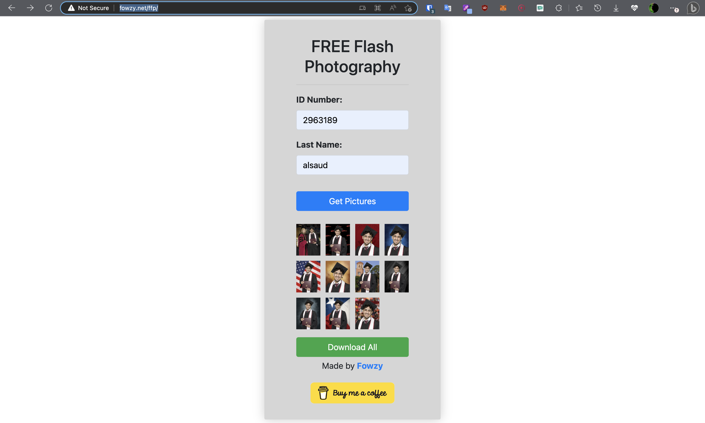

# ffp
F* Flash Photography, Download your digital pictures for your graudation for FREE, no charge! Tired of college spam and I want to help you not get scammed by your college.

## Instructions for Running:
Create a docker image:
>docker build -t ffp .

To run the container in normal mode
>docker run -t -p 8000:8000 -v /var/www/html/ffp:/var/www/html/ffp ffp

To run the container in detached mode (in the background): 
>docker run -t -d -p 8000:8000 -v /var/www/html/ffp:/var/www/html/ffp ffp

# UI 
This is a screenshot of the UI after it got successfully your graudation pictures ;)

To get the ID Number you need to get it from the email that you received from Flash Photography, as you can see at the bottom of the page you will see "ID#" that's what you need this number
